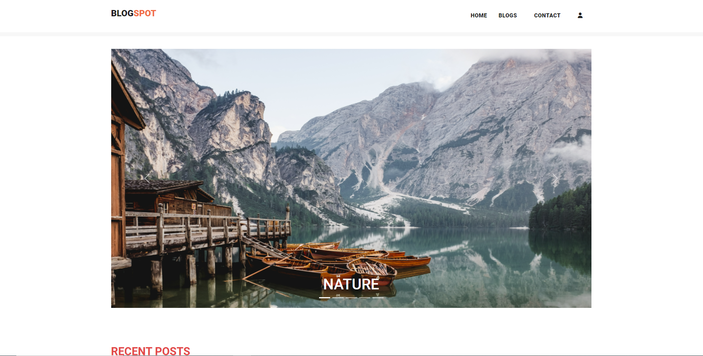
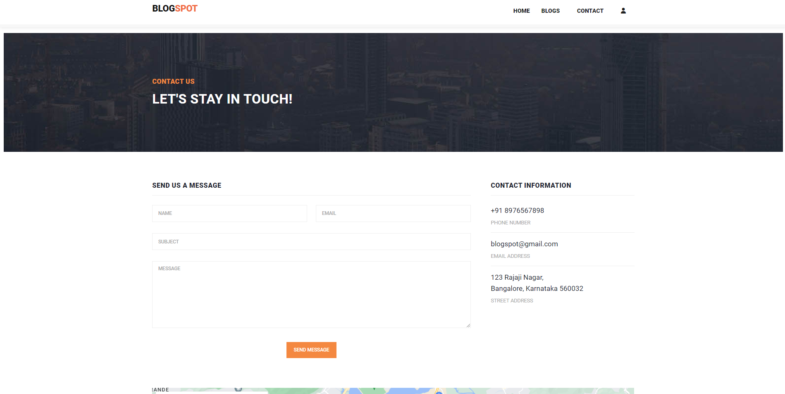
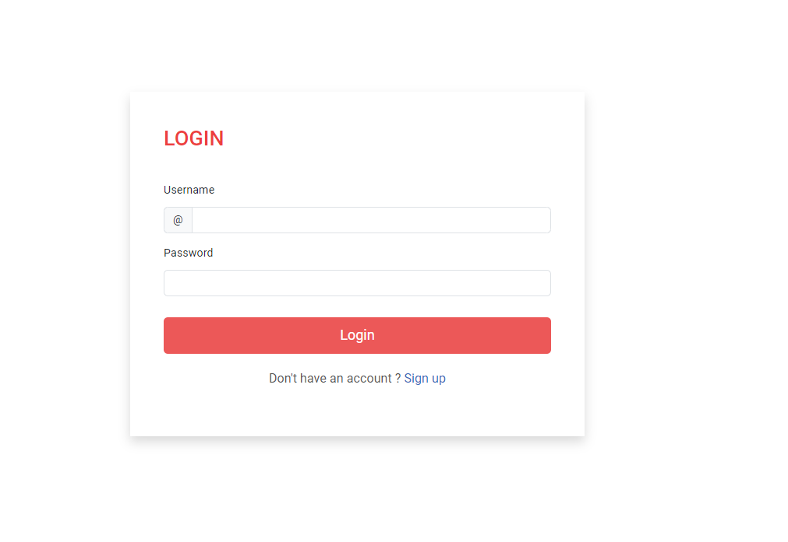
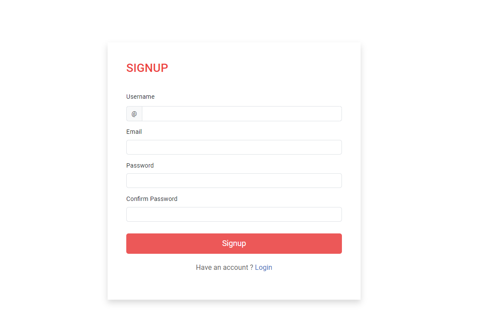

  <h1 align="center">Python Django Blog Website</h1>

Una aplicación de blog en Django contiene todas las características de un sitio de blog, como iniciar sesión/registrarse en el sistema, agregar publicaciones de blog con título, descripción e imagen y editar o eliminar la publicación de blog.

  <a href="https://blogs-n2mq.onrender.com/"><strong>➥ Live Demo</strong></a>

 

## 📃 Descripción

La creación de un blog en Django tiene un diseño de interfaz de usuario interactivo que permite a los usuarios ver lo que publican otros usuarios. También tiene un panel de administración a través del cual se pueden gestionar todas las publicaciones del blog y los usuarios.

 
 

 

## Features 

- **Manage Blog** :– In this feature includes the CRUD operation in a blog or content you create like adding, editing and deleting content of the blog
- **Login System** :- In this feature the admin can login to the system and manage all the feature of the system.
- **Blog** :- In this method which is the main method of the system.
- **Media** :- In this method which you can found all the media that you are upload in the system.
- **Template** :- In this method which is the design of the system that consist of HTML,CSS and JavaScript.

## 🚀 Setup/Installation Requirements

To view the website, 
* click [Python Django Blog Website](https://github.com/keerti1924/Python-Django-Blog-Website.git)
or 
* copy the link https://github.com/keerti1924/Python-Django-Blog-Website.git paste it to your browser and load it.  

## 🛠 Built With

* HTML
* CSS
* JAVASCRIPT
* PYTHON
* DJANGO
* DATABASE 

The system is built fully in Django Framework in back-end and HTML, CSS in front-end. It has full-featured user interface with all the functionalities

## ⭐️ Show your support 

Give a ⭐️ if you like this project!

