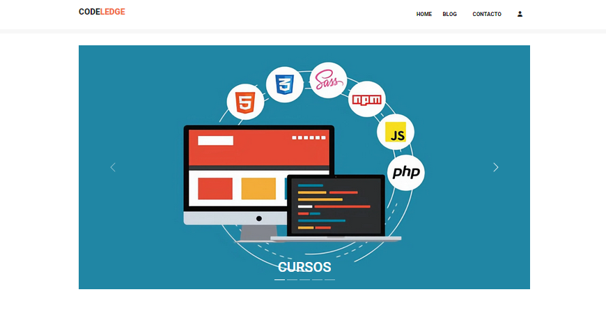
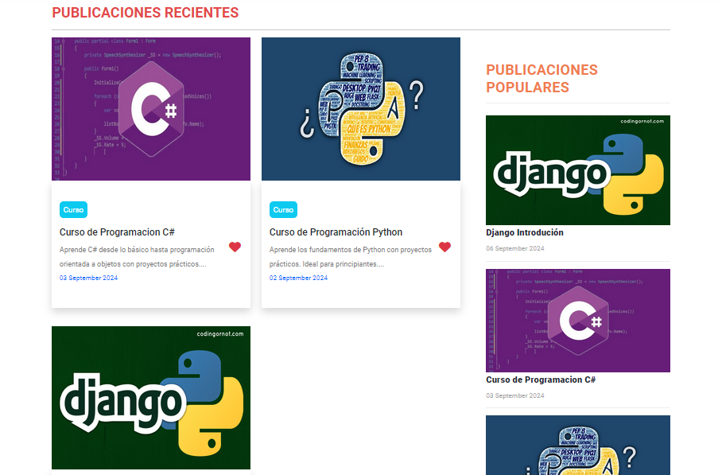
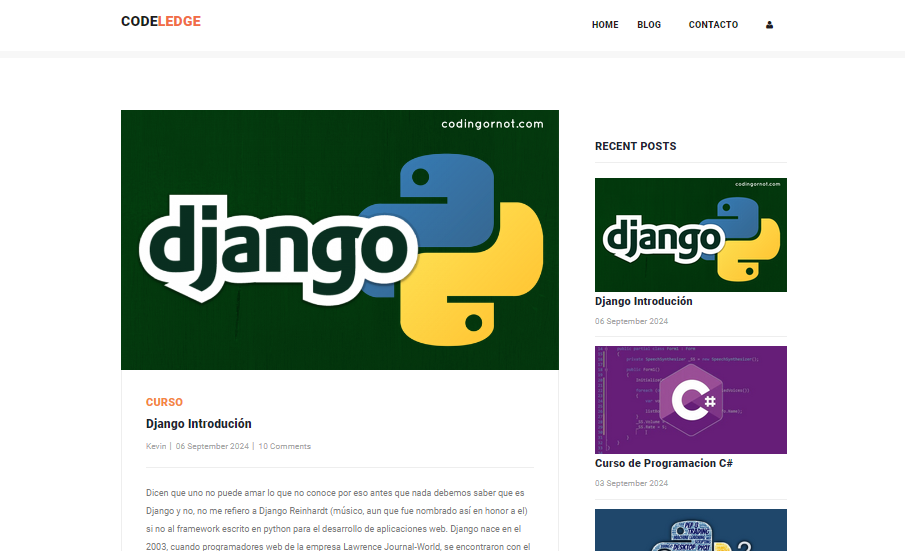

  <h1 align="center">Python Django Blog Website</h1>

 

## 📃 Descripción

La creación de un blog en Django tiene un diseño de interfaz de usuario interactivo que permite a los usuarios ver lo que publican otros usuarios. También tiene un panel de administración a través del cual se pueden gestionar todas las publicaciones del blog y los usuarios.

 
 

 

